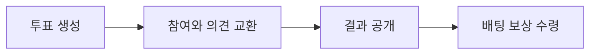
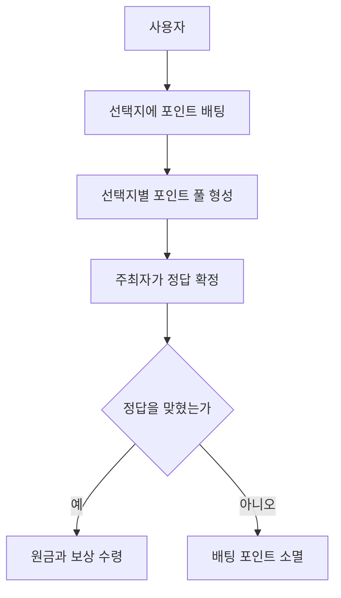
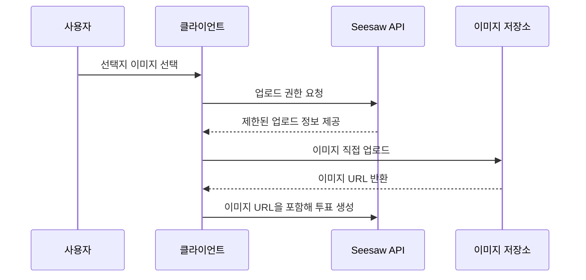
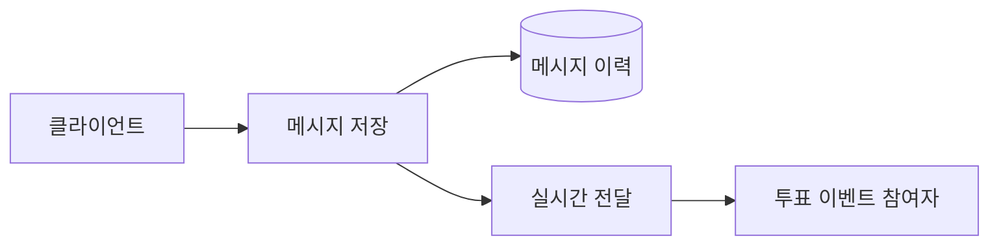
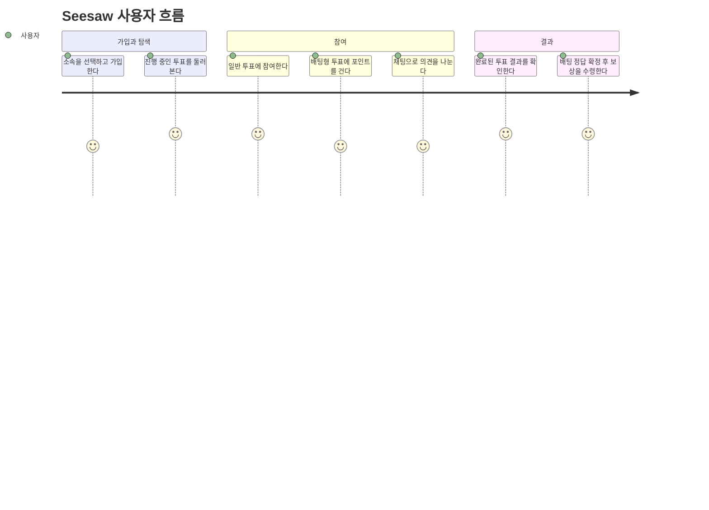
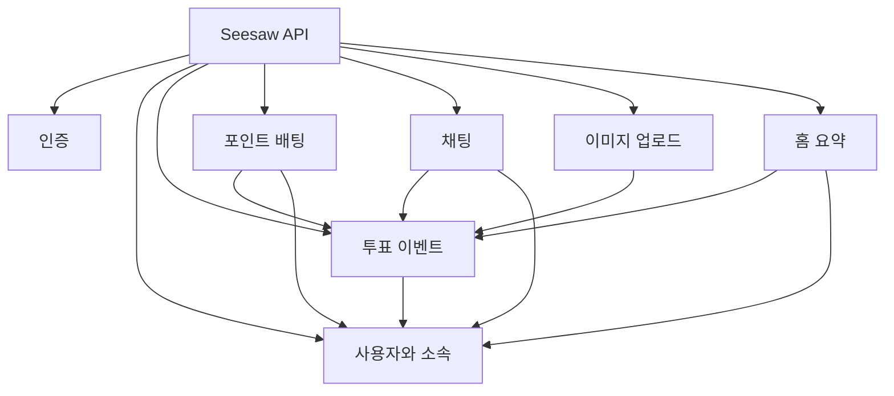
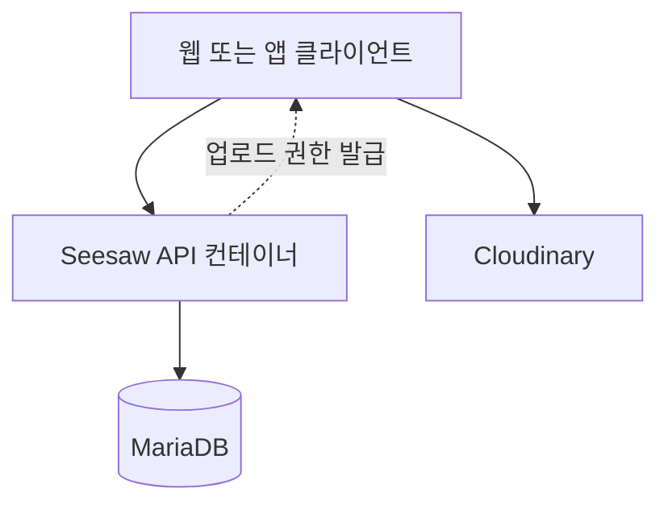
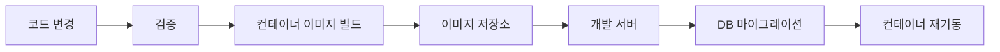

# Seesaw API

Seesaw API는 두 선택지 사이에서 의견을 고르고, 다른 사람들의 선택 결과를
확인하며, 배팅형 투표에서는 보유 포인트를 걸고 결과에 따라 보상을 받는 참여형
투표 서비스의 백엔드입니다.

이 프로젝트는 단순한 찬반 투표를 넘어서 다음 경험을 만드는 데 초점을 둡니다.

- 사용자가 가볍게 투표를 만들고 참여할 수 있는 구조
- 진행 중에는 결과를 제한하고, 완료 후에는 결과를 공개하는 정보 흐름
- 포인트 배팅을 통해 선택에 리스크와 보상을 부여하는 참여 방식
- 투표 이벤트별 채팅으로 참여자들이 의견을 주고받는 커뮤니티 경험
- 이미지 업로드, 실시간 메시지, 배포 자동화까지 포함한 실제 서비스형 백엔드

## 프로젝트 기획

Seesaw의 핵심은 “둘 중 하나를 고르는 순간”을 서비스화하는 것입니다. 점심 메뉴,
사내 이슈, 취향 비교처럼 가벼운 주제도 투표가 될 수 있고, 결과를 예측하는
배팅형 투표는 선택에 더 강한 몰입을 만듭니다.

서비스는 투표를 다음 세 단계로 바라봅니다.

진행 중인 투표에서는 참여자가 먼저 자기 선택을 해야 결과를 볼 수 있습니다. 이
정책은 결과를 먼저 보고 따라가는 행동을 줄이고, 각 사용자의 독립적인 선택을
유도합니다. 반대로 완료된 투표에서는 결과를 공개해 전체 흐름을 투명하게
보여줍니다.

## 포인트 배팅이란?

포인트 배팅은 사용자가 자신이 맞다고 생각하는 선택지에 보유 포인트를 거는
기능입니다. 일반 투표는 참여 횟수를 중심으로 결과를 계산하지만, 배팅형 투표는
얼마나 많은 포인트가 각 선택지에 걸렸는지도 함께 반영합니다.

예를 들어 A와 B 중 하나를 고르는 배팅형 투표가 있다면 사용자는 A 또는 B에
포인트를 겁니다. 투표 주최자가 최종 정답을 확정하면, 정답을 맞힌 사용자는 자신이
건 원금과 함께 패자 쪽에 모인 포인트를 지분에 따라 나누어 받습니다.

이 방식은 “누가 더 많이 선택했는가”뿐 아니라 “어느 쪽에 더 강한 확신이
모였는가”를 보여줍니다. 그래서 배팅형 투표는 단순 인기 투표보다 예측 게임에
가깝고, 사용자는 자신의 판단에 포인트라는 비용을 붙여 참여하게 됩니다.

## 제공 기능

### 사용자와 소속

사용자는 닉네임과 비밀번호로 가입하고, 서비스가 제공하는 소속 중 하나를
선택합니다. 소속 정보는 투표 결과를 볼 때 집단별 경향을 보여주는 기반이 됩니다.

사용자는 가입 시 기본 포인트를 받고, 이 포인트는 배팅형 투표에 참여할 때
사용됩니다. 포인트는 단순 잔액이 아니라 서비스 안에서 예측과 보상 경험을 만드는
핵심 자원입니다.

### 홈 요약

홈 화면은 현재 서비스가 얼마나 활발한지 보여주는 요약 정보를 제공합니다. 진행
중인 투표, 완료된 투표, 누적 참여 규모, 로그인 사용자의 포인트 상태를 한 번에
파악할 수 있도록 설계되었습니다.

### 투표 이벤트

투표 이벤트는 Seesaw의 중심 도메인입니다. 사용자는 제목과 두 선택지를 정해
투표를 만들고, 다른 사용자는 둘 중 하나를 선택해 참여합니다.

투표는 성격에 따라 일상, 밸런스, 업무, 배팅형 주제로 나뉩니다. 이 분류는
사용자가 관심 있는 투표를 찾고, 서비스가 투표 목록을 더 잘 구성하기 위한 기준이
됩니다.

투표 결과 노출은 상태에 따라 다릅니다.

- 진행 중인 투표: 참여 전에는 결과를 제한해 독립적인 선택을 유도합니다.
- 참여한 투표: 사용자가 선택한 뒤에는 현재 결과를 확인할 수 있습니다.
- 완료된 투표: 누구나 최종 결과와 통계를 볼 수 있습니다.

### 내가 만든 투표와 참여한 투표

사용자는 자신이 만든 투표와 참여한 투표를 따로 확인할 수 있습니다. 이 기능은
투표가 한 번 보고 끝나는 콘텐츠가 아니라, 사용자의 활동 이력으로 남는다는
전제를 반영합니다.

### 배팅 결과 확정과 보상

배팅형 투표는 주최자가 정답을 확정해야 마무리됩니다. 정답이 확정되면 더 이상
새로운 참여는 받지 않고, 승자는 보상을 수령할 수 있습니다.

보상 수령은 자동 지급이 아니라 사용자가 직접 요청하는 방식입니다. 이렇게 하면
사용자가 자신이 맞혔는지, 얼마나 벌었는지 확인하는 경험이 분명해지고, 포인트
변동도 명확한 사용자 행동과 연결됩니다.

### 이미지 업로드

투표 선택지에는 이미지를 붙일 수 있습니다. 이미지는 API 서버에 직접 저장하지
않고 외부 이미지 저장소로 바로 업로드하도록 설계되어 있습니다.

이 구조는 API 서버가 이미지 파일 자체를 처리하지 않아도 되기 때문에 백엔드의
부하와 저장 책임을 줄입니다. 동시에 투표 데이터에는 실제로 노출할 이미지 주소만
남기므로 도메인 데이터가 단순해집니다.

### 투표 이벤트 채팅

각 투표 이벤트에는 별도의 대화 공간이 있습니다. 사용자는 투표에 대한 의견을
남기고, 다른 참여자의 생각을 실시간으로 확인할 수 있습니다.

채팅은 두 가지 요구를 함께 다룹니다.

- 지난 메시지를 다시 볼 수 있는 이력 저장
- 접속 중인 사용자에게 새 메시지를 바로 전달하는 실시간성

## 서비스 흐름

사용자 관점에서 Seesaw의 대표 흐름은 다음과 같습니다.

## 백엔드 구성

Seesaw API는 하나의 백엔드 애플리케이션 안에서 기능별 책임을 나누는 구조입니다.
각 기능은 자기 데이터와 비즈니스 규칙을 소유하고, 다른 기능의 데이터가 필요할
때는 해당 기능의 경계를 통해 접근합니다.

이 구조에서 투표 이벤트는 가장 중심적인 도메인입니다. 사용자, 포인트, 이미지,
채팅은 모두 투표 이벤트를 풍부하게 만들기 위해 연결됩니다.

## 인프라 구조

로컬과 개발 배포 환경은 모두 컨테이너 기반으로 구성되어 있습니다. 애플리케이션
서버와 데이터베이스는 분리되어 있고, 이미지는 외부 저장소가 담당합니다.

개발 배포는 코드 검증, 이미지 빌드, 원격 서버 반영, 데이터베이스 마이그레이션,
서비스 재기동이 이어지는 흐름입니다.

운영 관점에서 중요한 분리는 다음과 같습니다.

- API 서버는 비즈니스 규칙과 인증, 투표, 채팅을 담당합니다.
- 데이터베이스는 사용자, 투표, 참여, 채팅 이력을 보관합니다.
- 이미지 파일은 외부 이미지 저장소가 담당합니다.
- 배포 자동화는 검증된 이미지만 서버에 반영하도록 구성되어 있습니다.

## 코드베이스 방향

이 저장소는 기능을 작게 나누되, 불필요한 계층을 늘리지 않는 방향을 따릅니다.
컨트롤러는 요청과 응답의 입구 역할에 집중하고, 실제 규칙은 기능별 서비스와
저장소 경계에 둡니다.

특히 투표 이벤트는 목록, 상세, 생성, 참여, 결과 확정, 보상 수령까지 많은 흐름을
가지므로 별도 도메인으로 분리되어 있습니다. 채팅과 홈 요약은 투표 이벤트를
직접 소유하지 않고, 필요한 정보를 투표 이벤트 도메인에서 받아 조합합니다.

## 문서 범위

이 README는 서비스를 소개하고 구조를 이해하기 위한 문서입니다. 세부 개발 규칙,
정확한 API 계약, 테스트 기준, 코드 경계는 별도 문서에 분리되어 있습니다.
