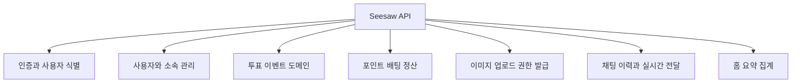
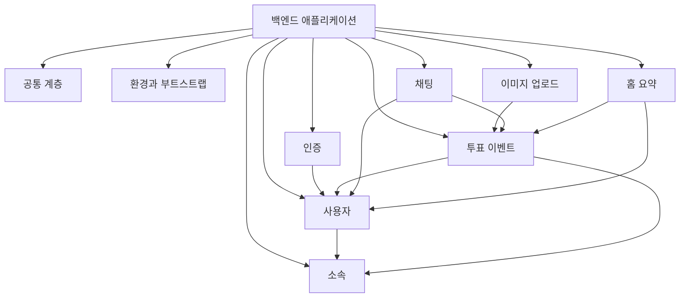
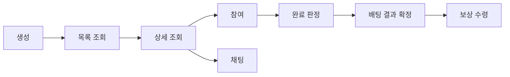
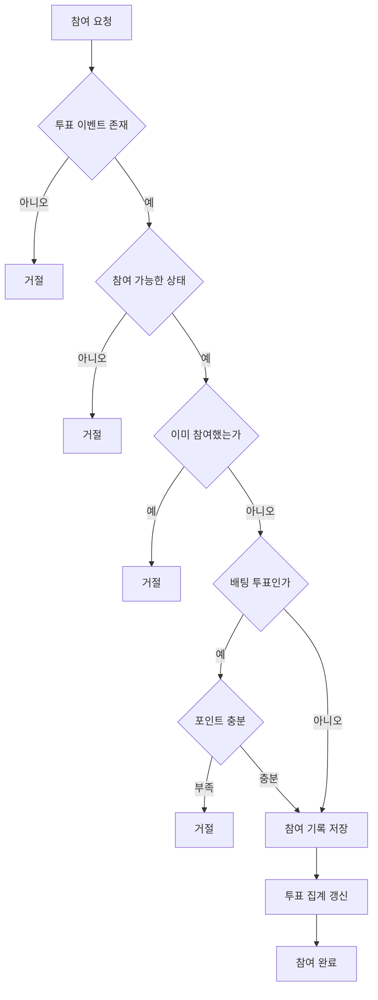
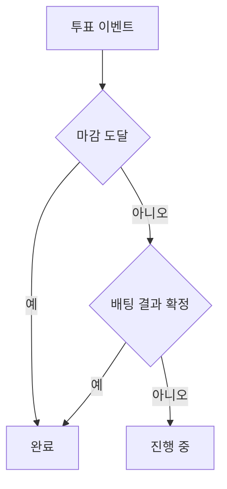
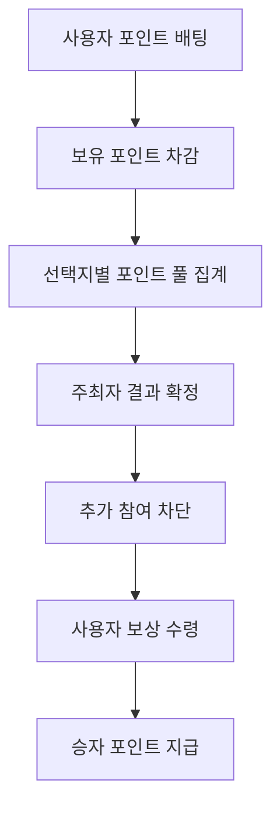
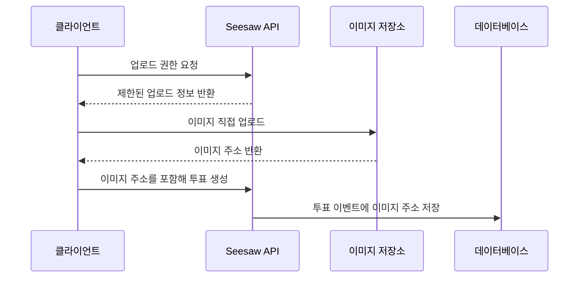
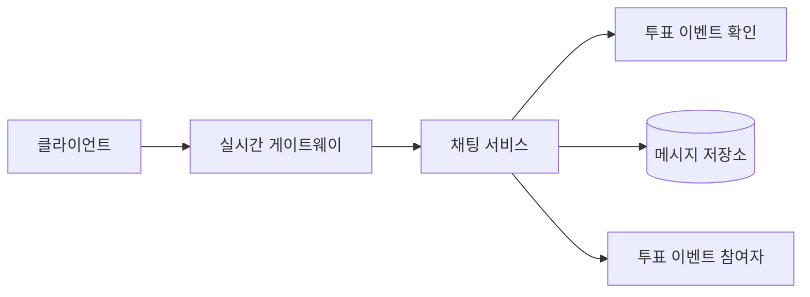
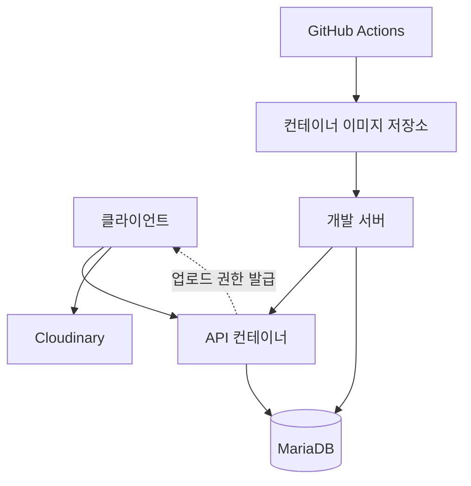
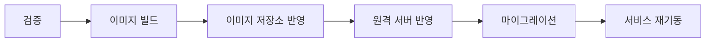

# Seesaw API

Seesaw API는 참여형 투표 서비스를 위한 백엔드 레포지토리입니다. 이 저장소는
인증, 사용자와 소속, 투표 이벤트, 포인트 배팅, 이미지 업로드, 채팅, 배포 구성을
하나의 서버 애플리케이션 안에서 다룹니다.

README는 백엔드 관점에서 다음 내용을 설명합니다.

- 어떤 서버 책임을 가진 레포지토리인지
- 핵심 기능이 어떤 모듈로 나뉘는지
- 투표 이벤트와 포인트 배팅 로직이 어떻게 흘러가는지
- 데이터 저장소, 이미지 저장소, 실시간 통신, 배포 파이프라인이 어떻게 연결되는지

## 백엔드 책임 범위

Seesaw API는 클라이언트가 직접 처리하기 어려운 서버 측 책임을 담당합니다. 인증된
사용자 식별, 투표 이벤트 상태 판정, 참여 이력 관리, 포인트 차감과 지급, 결과
공개 기준, 채팅 이력 저장, 이미지 업로드 권한 발급이 핵심입니다.

이 레포지토리는 화면 구성이나 프론트엔드 상태 관리를 소유하지 않습니다. 대신
클라이언트가 신뢰할 수 있는 기준으로 투표와 포인트 상태를 읽고 쓸 수 있도록
도메인 규칙과 데이터 일관성을 서버에서 보장합니다.

## 핵심 사용 기술

- NestJS: 기능별 모듈, 컨트롤러, 서비스, 전역 파이프와 필터를 구성하는 서버
  프레임워크입니다.
- TypeScript: 요청 데이터와 도메인 흐름을 정적 타입으로 다룹니다.
- MikroORM: MariaDB 엔티티, repository, migration, transaction 경계를 담당합니다.
- MariaDB: 사용자, 소속, 투표 이벤트, 참여 기록, 채팅 메시지를 보관하는 영속
  저장소입니다.
- JWT: 로그인 사용자 식별과 보호된 기능 접근에 사용됩니다.
- Socket.IO: 투표 이벤트별 채팅 메시지를 실시간으로 전달합니다.
- Cloudinary: 선택지 이미지를 API 서버가 직접 저장하지 않도록 분리한 외부 이미지
  저장소입니다.
- Docker와 GitHub Actions: 서버 이미지를 빌드하고 개발 서버에 배포하는 인프라
  흐름을 구성합니다.

## 백엔드 모듈 구성

각 기능은 자기 책임을 가진 모듈로 나뉩니다. 투표 이벤트는 가장 중심에 있고,
인증, 사용자, 이미지, 채팅, 홈 요약이 투표 이벤트를 기준으로 연결됩니다.

공통 계층은 응답 포맷, 오류 정규화, 요청 로깅처럼 전체 API에 공통으로 적용되는
흐름을 담당합니다. 기능 모듈은 비즈니스 규칙을 서비스에 두고, 데이터 접근은
repository 경계 뒤로 숨깁니다.

## 투표 이벤트 상세 로직

투표 이벤트는 생성, 목록 조회, 상세 조회, 참여, 완료 판정, 배팅 결과 확정, 보상
수령, 채팅 연계까지 이어지는 도메인입니다. 이 README에서 가장 중요한 백엔드
로직입니다.

### 생성

투표 이벤트 생성은 인증된 사용자를 주최자로 기록하는 것에서 시작합니다. 서버는
제목, 두 선택지, 카테고리, 마감 시각, 선택지 이미지 주소를 받아 하나의 투표
이벤트를 만듭니다.

생성 시점에는 참여자 수, 선택지별 참여 수, 선택지별 배팅 포인트, 전체 배팅
포인트를 모두 초기 상태로 둡니다. 이렇게 하면 이후 참여 로직은 매번 현재 집계를
다시 계산하지 않고, 참여가 발생한 순간 필요한 집계만 갱신할 수 있습니다.

마감 시각은 서버가 검증합니다. 너무 과거이거나 허용 범위를 벗어난 마감은 저장하지
않습니다. 이 규칙은 목록 조회, 참여 가능 여부, 완료 판정의 기준이 되므로 생성
단계에서 먼저 정리합니다.

### 목록 조회

투표 이벤트 목록은 서버 기준으로 진행 중인 목록과 완료된 목록을 나눕니다. 진행
중인지 완료되었는지는 단순히 클라이언트 시간이 아니라 서버에 저장된 마감과 배팅
결과 확정 상태로 판정합니다.

진행 중인 목록은 아직 참여 가능한 이벤트를 보여주고, 완료된 목록은 결과가
공개되어도 되는 이벤트를 보여줍니다. 내가 만든 투표와 내가 참여한 투표는 진행과
완료를 다시 나누지 않고, 사용자 이력 관점에서 하나의 목록으로 제공합니다.

목록 정렬과 필터링은 데이터베이스 조회 단계에서 처리합니다. 많은 투표 이벤트가
쌓여도 서버 메모리에서 전체 데이터를 가져와 정렬하지 않도록 하기 위해서입니다.

### 상세 조회와 결과 공개

상세 조회는 투표 결과를 언제 보여줄지 결정하는 중요한 경계입니다.

- 진행 중이고 아직 참여하지 않은 사용자는 결과 수치와 소속별 통계를 볼 수 없습니다.
- 진행 중이더라도 이미 참여한 사용자는 현재 결과를 볼 수 있습니다.
- 완료된 투표는 로그인 여부나 참여 여부와 무관하게 결과를 공개합니다.

이 규칙은 클라이언트 표시 정책이 아니라 서버의 비즈니스 규칙입니다. 서버가 결과
노출 여부를 판단하므로, 클라이언트는 응답을 임의로 해석해 숨기거나 보여줄 필요가
없습니다.

상세 조회에서는 선택지별 비율, 결과 수량, 전체 참여자 수, 소속별 통계, 내가
선택한 선택지, 내가 주최자인지 여부, 배팅 관련 정보를 함께 조합합니다.

### 참여

투표 참여는 한 사용자가 하나의 투표 이벤트에 한 번만 기록될 수 있습니다. 서버는
이미 참여한 사용자의 재참여를 막고, 마감되었거나 배팅 결과가 확정된 이벤트에는
새 참여를 허용하지 않습니다.

일반 투표와 배팅 투표의 참여 처리는 다릅니다.

- 일반 투표는 선택지별 참여 수와 전체 참여자 수를 증가시킵니다.
- 배팅 투표는 선택지별 참여 수뿐 아니라 사용자가 건 포인트와 선택지별 포인트
  풀도 함께 갱신합니다.
- 배팅 투표에서는 사용자의 보유 포인트가 부족하면 참여를 기록하지 않습니다.

참여 기록과 집계 갱신은 같은 transaction 안에서 처리됩니다. 사용자의 포인트만
차감되고 참여 기록이 누락되거나, 참여 기록은 남았지만 투표 집계가 갱신되지 않는
상태를 피하기 위해서입니다.

### 완료 판정

완료 판정은 두 가지 경로가 있습니다.

첫 번째는 마감 시각이 지난 경우입니다. 일반 투표와 배팅 투표 모두 마감이 지나면
완료된 투표로 취급합니다.

두 번째는 배팅 투표에서 주최자가 결과를 확정한 경우입니다. 이 경우 마감이 아직
남아 있더라도 서버는 해당 투표를 완료된 상태로 다룹니다. 결과가 확정된 뒤에는
추가 참여를 막아야 정산 기준이 흔들리지 않습니다.

## 포인트 배팅 로직

포인트 배팅은 투표 이벤트 도메인 안에서 처리되는 특수한 참여 방식입니다. 별도의
정산 장부를 새로 만들기보다, 투표 이벤트와 참여 기록, 사용자 포인트를 함께
사용합니다.

배팅 참여 시점에는 사용자의 포인트를 먼저 확인하고, 충분한 경우에만 차감과 참여
기록 저장을 같은 transaction에서 처리합니다. 배팅 결과 확정은 포인트 지급을 바로
수행하지 않습니다. 결과 상태만 먼저 기록하고, 실제 지급은 사용자가 보상 수령을
요청할 때 처리합니다.

보상은 승자 풀과 패자 풀을 기준으로 계산합니다. 승자는 자신이 건 원금을 돌려받고,
패자 풀은 승자들의 배팅 지분에 비례해 나누어 받습니다. 나눗셈으로 남는 자투리
포인트는 정해진 순서에 따라 분배해 전체 포인트 합계가 맞도록 합니다.

보상 수령은 반복 호출되어도 안전해야 합니다. 이미 수령한 승자는 추가 지급을 받지
않고 같은 결과로 처리됩니다. 패자는 받을 포인트가 없지만, 보상 흐름은 완료된
것으로 다룹니다.

## 이미지 업로드 흐름

선택지 이미지는 API 서버가 직접 저장하지 않습니다. 서버는 클라이언트가 외부 이미지
저장소에 업로드할 수 있는 제한된 권한만 발급하고, 실제 파일 전송은 클라이언트와
이미지 저장소 사이에서 일어납니다.

이 구조는 API 서버가 이미지 바이너리 저장, 파일 크기 처리, 미사용 파일 정리 같은
책임을 직접 떠안지 않도록 만듭니다. 백엔드는 투표 이벤트에 필요한 이미지 주소만
도메인 데이터로 저장합니다.

## 채팅 흐름

채팅은 투표 이벤트에 종속된 기능입니다. 별도의 채팅방 도메인을 크게 만들지 않고,
투표 이벤트 하나를 하나의 대화 공간으로 취급합니다.

메시지를 저장하기 전에 서버는 대상 투표 이벤트가 존재하는지 확인합니다. 메시지는
영속 저장소에 남긴 뒤 같은 투표 이벤트를 보고 있는 사용자에게 실시간으로
전달됩니다. 클라이언트 재전송으로 같은 메시지가 중복 저장되지 않도록 사용자와
클라이언트 메시지 식별자를 기준으로 중복을 방지합니다.

## 인프라 구성

인프라는 API 서버, 관계형 데이터베이스, 외부 이미지 저장소, 이미지 빌드와 배포
자동화로 나뉩니다.

로컬 환경은 API 서버와 데이터베이스를 컨테이너로 분리해 실행합니다. 개발 배포
환경은 이미 빌드된 서버 이미지를 받아 실행하고, 데이터베이스는 별도 컨테이너와
볼륨으로 유지합니다.

배포 자동화는 검증, 이미지 빌드, 이미지 저장소 반영, 원격 서버 반영,
마이그레이션, 서버 재기동 순서로 구성됩니다.

## 문서 범위

이 README는 백엔드 레포지토리의 구조와 주요 로직을 이해하기 위한 문서입니다.
세부 API 계약, 실행 방법, 테스트 명령, 환경 변수, 응답 구조는 별도 문서와 코드가
기준입니다.
