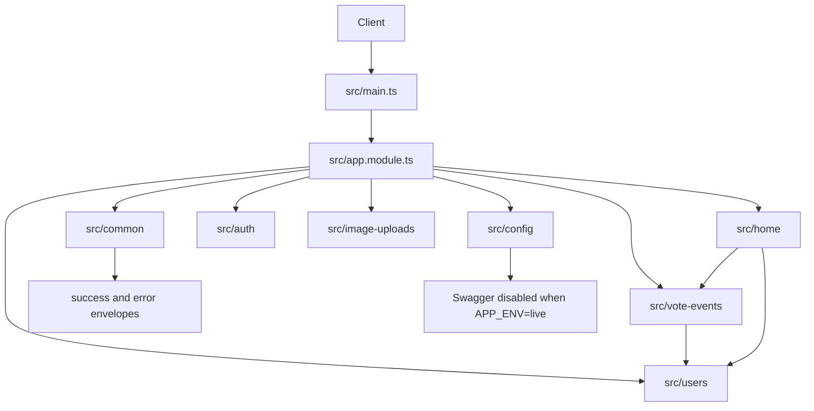

# Architecture

Seesaw API는 하나의 NestJS app 안에서 feature module이 자기 HTTP, service,
persistence boundary를 소유하는 구조다. Public API contract는
`API_CONTRACT.md`, 디렉터리 책임은 `PROJECT_STRUCTURE.md`가 source of truth다.

## Runtime Flow

## Module Ownership

- `src/config/` owns env validation, API prefix, CORS origins, Swagger setup,
  and MikroORM config.
- `src/common/` owns response wrapping, exception normalization, and logging.
- `src/auth/` owns login, refresh, JWT verification, and required/optional bearer
  guards.
- `src/image-uploads/` owns Cloudinary signed upload parameter generation. Image
  binaries go directly from the client to Cloudinary.
- `src/users/` owns user persistence, password verification, nickname checks,
  vote token storage, and affiliation lookup for user ids.
- `src/vote-events/` owns vote event creation, participation writes, aggregate
  counters, ongoing/completed reads, result visibility, and vote event DB access.
- `src/home/` owns the main-page summary read and composes vote-event/user data
  through exported providers.

## Boundaries

- Controllers stay thin and return DTO payloads, not `{ data: ... }` envelopes.
- Expected domain 4xx errors are feature-local `HttpException` subclasses.
- Services decide domain errors but do not assemble public error payloads.
- Repositories do not absorb another feature's data ownership. Import the owning
  module/provider instead.
- Swagger decorators stay beside their controller; app-level Swagger setup stays
  in `src/config/swagger.ts`.

## Auth

- Required authenticated routes use `JwtAuthGuard`.
- Optional bearer routes use `OptionalJwtAuthGuard`; no header means anonymous,
  invalid header means `401 invalid_access_token`.
- Resource-specific authorization belongs in services after guard-level identity
  parsing.

## DB And Tests

- MariaDB access goes through MikroORM repositories/providers.
- Migrations live under `src/migrations/`.
- Unit tests fake providers directly.
- E2E tests boot the Nest app with `API_PREFIX` and assert public envelopes.
- Swagger tests generate OpenAPI JSON and assert route, schema, security, and
  example contract.
